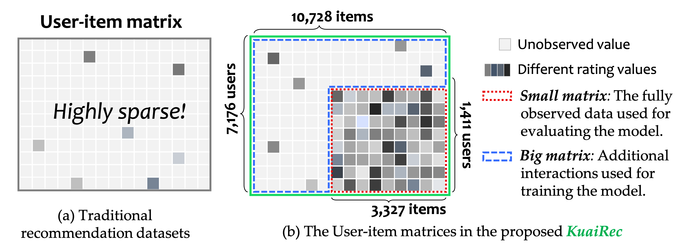

# KuaiRec by **Samy YACEF**
This report is a summary of my work on the KuaiRec project, which is a recommendation system for a video streaming platform. In this report, I will NOT discuss the data analysis of the different dataset that I used as they have their own Notebooks (Check the `./notebook/` folder for more informations on this).

Instead, I will focus on the recommendation system itself and the different models that I implemented and explain my choices. I will also discuss the evaluation metrics that I used to measure the performance of the models and the results that I obtained.

## Table of Contents
- [KuaiRec](#kuairec)
  - [Introduction](#introduction)
  - [Evaluation Metrics](#evaluation-metrics)
  - [Recommendation System](#recommendation-system)
    - [Collaborative Filtering](#collaborative-filtering)
    - [Content-Based Filtering](#content-based-filtering)
  - [Conclusion](#conclusion)

## Introduction
In 2022, the **University of Science and Technology of China** released a scientific article along with a unique dataset collected from the Chinese video-streaming platform **Kuaishou**, covering a period of two months. This dataset captures interactions between over **8,000 users** and more than **10,000 videos**.

A key feature of this dataset is its division into two interaction matrices (see figure below):

- **Large matrix**: A sparse matrix with a density of approximately **16.3%**, resembling real-world data where users interact with only a small fraction of items.
- **Small matrix**: A dense matrix with a density of around **99.6%**, providing a near-complete view of user preferences.

---

In most recommendation systems, the most faithful method for evaluating a model is through **online testing**—deploying the model to real users and observing their behavior. However, such an approach is often **costly, time-consuming**, or simply **infeasible**.

The **KuaiRec** dataset provides an effective alternative by enabling offline model evaluation:

1. **Training phase**: Use the **sparse large matrix** to train the model. This simulates a real-world recommendation scenario with limited interaction data.
2. **Evaluation phase**: Test the model on the **dense small matrix**. This allows for a reliable estimation of model performance in an environment that closely approximates actual user behavior.

This setup offers a **practical and scalable evaluation framework** that mimics real-world deployment—without needing live user experiments.

## Evaluation Metrics

In this project, I employed the following evaluation metrics to assess the performance of the models:

**Note**: After conducting tests, I determined that an item should be recommended if the predicted `watch_ratio` exceeds **0.8**.

- **Error Metrics**:
  - **MAE**: Measures the average absolute error between the predicted `watch_ratio` and the actual.
  - **RMSE**: Measures the square root of the average squared error between the predicted `watch_ratio` and the actual.

- **Accuracy-Based Metrics**:
  - **Precision**: Measures the proportion of relevant items among the recommended items, focusing on items the user is likely to click on.
  - **Hit Rate**: Measures the proportion of relevant items that were recommended, considering the challenge of sparse data in the training set.
  - **MRR**: Measures the average rank of relevant items among the recommended items.
  - **NDCG**: Measures the relevance of recommended items, accounting for their position.

## Recommendation System
### Collaborative Filtering

Collaborative filtering is a recommendation technique that relies on user-item interactions to make predictions. As our main dataset consist of user-item interactions, collaborative filtering is a natural choice for our first implementation that will serve as a baseline recommendation system.

An alternative least squares (ALS) algorithm has been implemented to learn the latent factors of users and items. As an ALS algorithm performs well with sparse data, so it is particularly suitable for our large matrix, with its low density.

The result after some hyperparameter tuning has the following results:
| Metric       | Value |
|--------------|-------|
|(RMSE)        | 0.5518|
|(MAE)         | 0.3170|
|Precision@20  | 0.2322|
|Hit Rate@20   | 1.0000|
|MRR@20        | 0.9634|

For the error-base metrics, they indicate a reasonably low level of prediction error, suggesting the model is accurately estimating user-item ratings.

As of the accuracy-based metrics. The high `Hit Rate` and `MRR` scores demonstrate that the recommender consistently places relevant items within the top-20 recommendations. A `Hit Rate` of **1.0000** means that at least one relevant item is always present in the top-20 list, and the `MRR` of **0.9634** reflects that relevant items tend to be ranked very highly. `Precision@20` shows that roughly **23%** of the top-20 items are relevant, indicating solid relevance density.

Overall, these results suggest that the tuned ALS model performs well for both rating prediction and top-N recommendation tasks, making it effective for personalized recommendation scenarios but as we have other datasets, portraying meta-data of the users and items, we may be able to improve the model by adding more features to it.

### Content-Based Filtering

Content-based filtering is a recommendation technique that relies on the features of items to make predictions. In this project, I implemented content-based filtering models using the `XGBoost` library. 

A Data Analysis was performed to determine the most relevant features to use for the following models, you can find the details in the `./notebooks/EDA_user_behaviour.ipynb` notebook.

#### Pointwise Ranking Model
The first implementation was based on the prediction of the `watch_ratio` of the each item separately. This implemetation is a pointwise ranking model, which means that it predicts the `watch_ratio` of each item for each user.

After some fine-tuning of the hyperparameters, the model achieved the following results:

| Metric       | Value |
|--------------|-------|
|RMSE          | 0.5750|
|MAE           | 0.4076|
|Precision@20  | 0.0386|
|Hit Rate@20   | 1.0000|
|MRR@20        | 0.9185|

The error-based metrics are above the ones obtained with the collaborative filtering model, indicating a higher level of prediction error but overall, the model is still able to predict the `watch_ratio` of the items with a reasonable accuracy.

However, the accuracy-based metrics are not as good as the ones obtained with the collaborative filtering model. The `Precision@20` is very low, indicating that the model is not able to recommend relevant items to the users. The `Hit Rate@20` and `MRR@20` are still high, indicating that the model is able to recommend at least one relevant item in the top-20 list but the relevance density is very low.

#### Listwise Ranking Model
For the second implementation of the content-based filtering model, I used `XGRanker` of the library `XGBoost` to implement a listwise approach. This is a gradient boosting model that is specifically designed for ranking tasks.

The `XGBRanker` model was trained using the same features as the previous model, unlike pointwise ranking models, listwise ranking models take into account the entire list of items when making predictions. This allows the model to learn the relative importance of each item in the list and to optimize the ranking of the items.

After some fine-tuning of the hyperparameters, the model achieved the following results:

| Metric       | Value |
|--------------|-------|
|RMSE          | 1.3426|
|MAE           | 1.2025|
|Precision@20  | 0.0415|
|Hit Rate@20   | 1.0000|
|MRR@20        | 0.9431|
|NDCG@20       | 0.3314|

The error-based metrics are well above the ones obtained with the collaborative filtering model, indicating a higher level of prediction error but as our model is a listwise ranking model, we should not focus on these metrics.

The accuracy-based metrics are better than the ones obtained with the pointwise ranking model. The `Precision@20` is still low, but the `Hit Rate@20` and `MRR@20` are still high, indicating that the model is able to recommend at least one relevant item in the top-20 list. The `NDCG@20` is also a good indicator of the relevance of the recommended items, indicating that the model is able to recommend relevant items in the top-20 list.

## Conclusion
In this report, I presented the different models that I implemented for the KuaiRec project. I started with a collaborative filtering model based on ALS, which served as a baseline recommendation system. I then implemented two content-based filtering models using `XGBoost`, one based on pointwise ranking and the other based on listwise ranking.

The results of the models were evaluated using different metrics, and I discussed the strengths and weaknesses of each model. Overall, the collaborative filtering model performed well for both rating prediction and top-N recommendation tasks, while the content-based filtering models showed promise but required further tuning to improve their performance.

I have re-evaluated the ALS model with more recommendations based on the top-100 items recommandation instead of top-20 and the precision is now **0.3218** and the other metrics are still the same.

A more advanced model could be implemented by combining the collaborative filtering and content-based filtering models, which would allow us to leverage the strengths of both approaches. However, as the content-based models were performing poorly, I decided to stop at this stage. An other interesting approch would be to use an engagement score instead of the `watch_ratio` to predict the user-item interactions. This would allow us to take into account more features of the interactions
